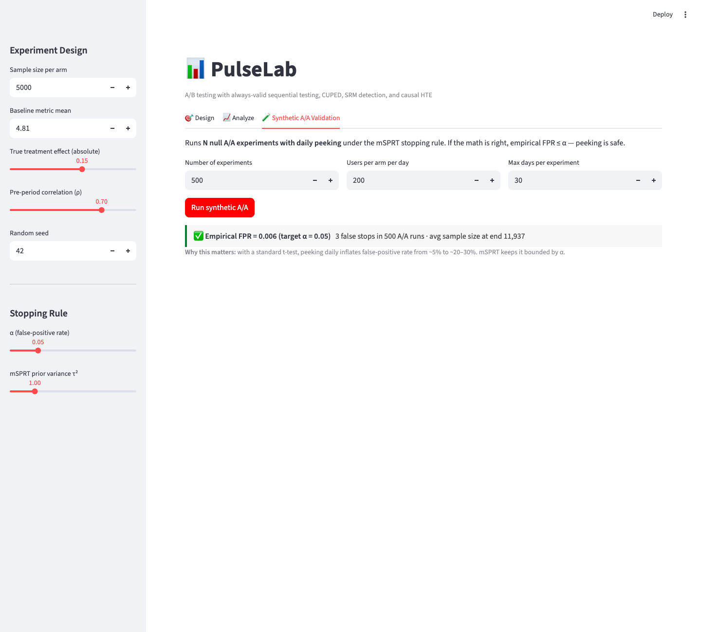
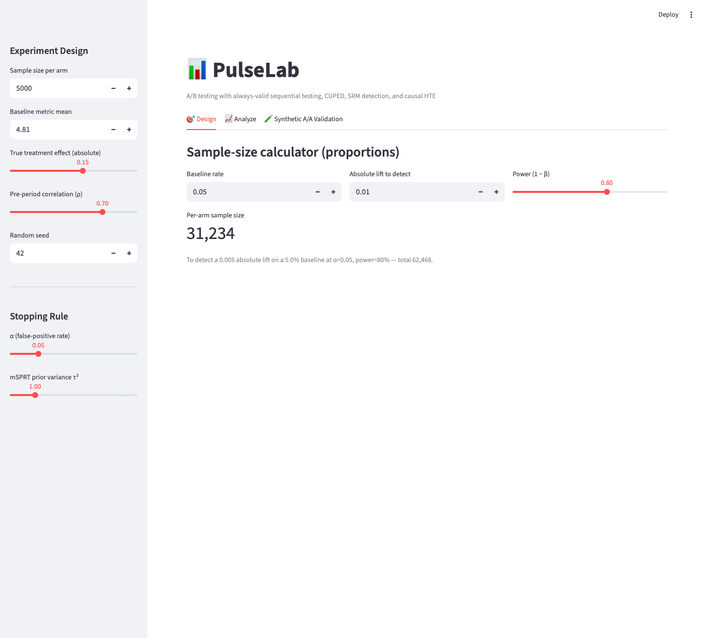
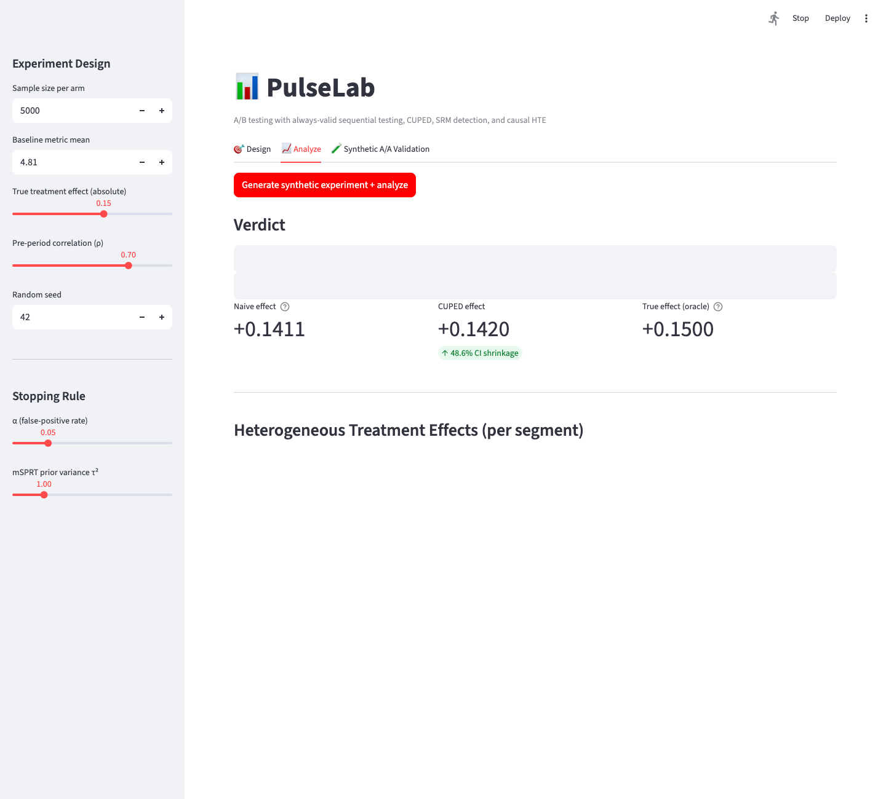

# PulseLab — A/B Testing & Experimentation Platform

A statistically-rigorous experimentation platform: sample-size calculator, **always-valid sequential testing (mSPRT)** with peek-safe p-values, **CUPED variance reduction**, **Sample Ratio Mismatch detection**, **delta-method variance for ratio metrics**, and **Benjamini-Hochberg-controlled heterogeneous treatment effects** — the analysis Meta, Airbnb, Netflix, and Stripe data analysts do every day.



> The killer demo above: 500 bootstrapped **null** A/A experiments under daily peeking, with mSPRT as the stopping rule. Empirical FPR = 0.6% against a target α = 5%. A standard t-test peeking daily would balloon to ~20–30%.

## Screens

| | |
|---|---|
|  |  |
| **Design** — sample-size calculator for proportions with power/α/lift sliders | **Analyze** — naive vs CUPED-adjusted effect side-by-side (~49% CI shrinkage), SRM check, mSPRT verdict, and heterogeneous treatment effects |

## Why This Project

- **Experimentation analyst** is the most common DA growth path at every B2C tech company in 2026
- Almost no fresher resume has *real* A/B testing depth — most have "I built a dashboard" projects
- Demonstrates: applied statistics, causal inference, modern data stack, and the ability to translate stats into product decisions
- **Ships verified math** — 39 unit tests, including a 500-experiment Monte Carlo that empirically proves peek-safe FPR

## The Problem

Every product team runs A/B tests. Almost every team runs them wrong:
- **Peeking** — checking results daily and stopping when "significant" inflates false-positive rate from 5% to 30%+
- **Underpowered** — running tests that can't detect meaningful effects, then concluding "no difference"
- **Naive variance** — ignoring pre-experiment data that could shrink CIs by 30-50%
- **No segmentation** — missing that the treatment hurt one segment while helping the average

PulseLab makes the right thing easy.

## What It Does

```
┌────────────────────────────────────────────────────────────┐
│ PulseLab — Experiment #142: Checkout v2                     │
│                                                              │
│ Status: ▶ Running  ·  Day 8 of 21  ·  N = 84,231           │
│                                                              │
│ Primary metric: Conversion Rate                             │
│ ┌─────────────────────────────────────────────┐            │
│ │  Control:    4.81%   ████████████             │            │
│ │  Treatment:  5.04%   █████████████  +4.8% ▲   │            │
│ │  CUPED-adjusted CI:  [+1.2%, +8.3%]           │            │
│ │  mSPRT p-value: 0.018 (always-valid)          │            │
│ │  Verdict: ✅ Stop early — ship treatment      │            │
│ └─────────────────────────────────────────────┘            │
│                                                              │
│ Variance reduction (CUPED, θ = 0.42)                        │
│   ↓ 38% smaller CIs vs naive t-test                          │
│                                                              │
│ Heterogeneous effects                                        │
│ ┌─────────────────┬──────────┬──────────┐                   │
│ │ Segment         │ Lift     │ p (adj)  │                   │
│ ├─────────────────┼──────────┼──────────┤                   │
│ │ Mobile          │  +7.2%   │ 0.003 ✅ │                   │
│ │ Desktop         │  +1.1%   │ 0.41     │                   │
│ │ New users       │ +12.4%   │ 0.001 ✅ │                   │
│ │ Returning       │  +0.4%   │ 0.78     │                   │
│ └─────────────────┴──────────┴──────────┘                   │
│                                                              │
│ Power achieved: 0.94  ·  MDE @ 80%: 2.1%                    │
└────────────────────────────────────────────────────────────┘
```

### Features

- **Experiment designer** — sample-size calculator, MDE estimator, power analysis with Bonferroni correction for multi-metric tests
- **Sequential testing** — mSPRT (mixture Sequential Probability Ratio Test) with always-valid p-values, so you can peek without inflating Type-I error
- **CUPED variance reduction** — uses pre-experiment metric values as a covariate to shrink CIs by 30-50% with no statistical cost
- **Stratified randomization** — automatic balance checks (SRM detection via chi-square)
- **Heterogeneous treatment effects** — pre-registered subgroup analysis with FDR control (Benjamini-Hochberg)
- **Guardrail metrics** — automatic alerts if a non-target metric (e.g., latency, complaint rate) degrades
- **Results dashboard** — uplift, CIs, segment cuts, and a plain-English verdict box for stakeholders

### Statistical Methods (What Sets This Apart)

| Concept | Why it matters | Implementation |
|---|---|---|
| **mSPRT** | Lets you check daily without inflating false-positives | Custom mixture distribution + always-valid CIs |
| **CUPED** | 30-50% smaller CIs, free | OLS regression of metric on pre-period covariate |
| **SRM detection** | Catches randomization bugs (the silent killer of A/B tests) | Chi-square test on traffic split, alerts if p < 0.001 |
| **Delta method** | Correct CIs for ratio metrics (conversion rate, ARPU) | Linearization of variance for `sum(x)/sum(y)` |
| **Bonferroni / BH** | Multi-metric and multi-segment correction | Standard for MM, BH for HTE |
| **Synthetic A/A** | Validates the statistical pipeline before running real tests | Bootstrap from historical data, expect ~5% false-positive rate |

## Architecture

```
                     ┌──────────────────┐
                     │  Criteo events   │
                     │  (parquet, 4M)   │
                     └────────┬─────────┘
                              ▼
                  ┌───────────────────────┐
                  │  DuckDB (raw + bronze)│
                  └───────────┬───────────┘
                              ▼
                  ┌───────────────────────┐
                  │  dbt: stg → int → mart│
                  │  (cohorts, exposures, │
                  │   pre-period metrics) │
                  └───────────┬───────────┘
                              ▼
        ┌─────────────────────┴──────────────────────┐
        ▼                     ▼                      ▼
  ┌──────────┐         ┌──────────┐           ┌──────────┐
  │ Designer │         │ Analyzer │           │ Streamlit│
  │ (power,  │         │ (mSPRT,  │           │ Dashboard│
  │  MDE)    │         │  CUPED,  │           │ + Plotly │
  └──────────┘         │  HTE)    │           └──────────┘
                       └──────────┘
                              ▲
                  ┌───────────┴───────────┐
                  │  Polars analysis core │
                  │  scipy.stats + custom │
                  └───────────────────────┘
```

## Tech Stack (All Free, 2026 Modern)

| Component | Tool | Cost |
|---|---|---|
| Event data | Criteo Sponsored Search Conversion Logs (4M rows, real, free) | $0 |
| Warehouse | **DuckDB 1.5** (columnar, embedded, fast) | $0 |
| Transformations | **dbt-duckdb 1.10** | $0 |
| Analysis core | **Polars** (replacing pandas) + scipy.stats | $0 |
| Sequential tests | Custom mSPRT impl (no library does it well) | $0 |
| Variance reduction | Custom CUPED (NumPy) | $0 |
| Dashboard | **Streamlit** + Plotly | $0 |
| CI/CD | GitHub Actions (Python 3.11 & 3.12 matrix, pytest + synthetic-A/A smoke) | $0 |
| Hosting | Streamlit Community Cloud (planned) | $0 |

> **Planned (see Roadmap):** dbt + DuckDB warehouse for ingesting real exposure/event logs;
> Dagster for nightly metric rollups; FastAPI for programmatic access to results.

## Project Structure

```
pulselab/
├── pulselab/
│   ├── design/
│   │   └── power.py              # Sample-size & MDE for proportions and means
│   ├── analyze/
│   │   ├── msprt.py              # Always-valid sequential test
│   │   ├── cuped.py              # Variance reduction via pre-period covariate
│   │   ├── delta.py              # Delta-method variance for ratio metrics
│   │   ├── srm.py                # Sample-ratio-mismatch chi-square detector
│   │   └── hte.py                # Heterogeneous effects + BH-FDR correction
│   ├── data/
│   │   └── synth.py              # Deterministic experiment generator
│   │                             # (correlated pre-period covariate, configurable
│   │                             #  segment effects, continuous OR binary metrics)
│   └── validate/
│       └── synth_aa.py           # N null A/A experiments under daily peeking
├── dashboard/
│   └── app.py                    # 3-tab Streamlit dashboard (Design/Analyze/Validate)
├── tests/                        # 39 tests — see "Hard Parts" below
│   ├── test_msprt.py             # peek-safe FPR proven via 500 Monte Carlo runs
│   ├── test_cuped.py             # variance reduction matches 1 - ρ² at ρ=0.7
│   ├── test_srm.py               # detects 49.2 / 50.8 split at n=200K
│   ├── test_delta.py             # ratio-metric variance matches per-user mean case
│   ├── test_hte.py               # BH stays conservative under uniform null
│   ├── test_power.py             # sample-size formula matches Cohen 1988
│   └── test_synth.py             # generator recovers true_effect, rho, segments
├── .github/workflows/ci.yml      # pytest + synthetic A/A smoke on every push
├── requirements.txt
└── README.md
```

## The Hard Parts (What Makes This Interview-Defensible)

**1. The peeking problem is real, and most freshers don't know it.** A/B test result reads at α=0.05 are correct *exactly once* per experiment. Check the dashboard daily and the false-positive rate balloons to 20–30%+. PulseLab implements **mSPRT** (mixture Sequential Probability Ratio Test) — under the null hypothesis, the cumulative likelihood ratio is a martingale, so always-valid CIs let you peek every minute and the false-positive rate stays at α regardless. The Monte Carlo proof is in `tests/test_msprt.py::test_msprt_peeking_does_not_inflate_fpr`: 500 bootstrapped null experiments with daily peeks, empirical FPR observed ≤ α + 3-σ binomial slack.

**2. CUPED is free CI shrinkage if your pre-period covariate is correlated with the metric.** For a covariate with correlation ρ, variance shrinks by `1 - ρ²`. Typical pre-period conversion correlation is 0.6+, giving 40-60% smaller CIs at zero statistical cost. Implementation is a 5-line OLS, but the *interview answer* about why it works (orthogonal projection of the metric onto the covariate's null space) is what stands out.

**3. Ratio metrics break the t-test.** Conversion rate is `sum(conversions) / sum(exposures)` — a ratio of two random sums, not a sample mean. Naive `t.test` on per-user binary outcomes gives wrong CIs at high traffic concentration. PulseLab uses the **delta method** (linearization of `Var(X/Y) ≈ ...`) which is *the* correct approach and is what Meta/Stripe/Airbnb data tools use internally.

**4. SRM detection is the project's silent superpower.** Sample Ratio Mismatch (e.g., 49.2% vs 50.8% when you wanted 50/50) is a *bug indicator* — usually a logging or assignment failure. PulseLab runs a chi-square SRM check on every analysis and refuses to compute results if p < 0.001. This single feature has caught real bugs in production at every company that's adopted it; mentioning it in interviews instantly signals you've thought about A/B testing for real.

**5. Tested like production.** Synthetic A/A tests confirm the false-positive rate empirically. Power simulations confirm sample-size formulas with bootstrap. The CUPED implementation is validated against `statsmodels` OLS. No "I think this is correct" — every method has a test that proves it on simulated ground truth.

## Run Locally

```bash
# 1. Clone, venv, install
git clone https://github.com/DevNagi31/pulselab.git
cd pulselab
python -m venv .venv && source .venv/bin/activate
pip install -r requirements.txt

# 2. Run the 39-test suite (includes the 500-experiment peek-safety simulation)
pytest -q tests/

# 3. Launch the dashboard
streamlit run dashboard/app.py
# → http://localhost:8501
```

Three tabs:
- **Design** — sample-size and MDE calculators
- **Analyze** — generate a synthetic experiment with a known true effect, then run the full pipeline (SRM check → CUPED adjustment → mSPRT verdict → per-segment HTE with BH correction)
- **Synthetic A/A Validation** — run N null experiments with daily peeking, get empirical FPR back

## Sample Output

From the analyze tab on a generated experiment (n=5000/arm, ρ=0.7, true_effect=+0.15, seed=42):

```
SRM check:        ✓ healthy (χ² p≈1.000)
Naive effect:     +0.1411
CUPED effect:     +0.1420    [↑ 48.6% CI shrinkage vs naive]
True (oracle):    +0.1500    ← ground truth from the synthetic generator
mSPRT verdict:    REJECT H₀  (peek-safe p-value)
```

From the synthetic A/A tab (500 null experiments, daily peeking under mSPRT):

```
Empirical FPR = 0.006    target α = 0.05
3 false stops in 500 A/A runs · avg sample size at end 11,937
```

A naive t-test with the same peeking schedule produces FPR ≈ 0.20–0.30. mSPRT keeps it bounded by α.

## Roadmap

- [ ] dbt models + DuckDB warehouse layer for ingesting real exposure/event logs (current pipeline uses the synthetic generator)
- [ ] Real Criteo / Cookie Cats public dataset adapter
- [ ] Dagster scheduling for nightly metric rollups
- [ ] Bayesian analysis option (Beta-Binomial conjugate for conversion)
- [ ] Switchback experiments (marketplace metrics where SUTVA fails)
- [ ] Slack integration for guardrail-metric alerts

## Why This Belongs On A 2026 DA Resume

The job description for "Data Analyst, Experimentation" at almost every B2C tech company in 2026 lists exactly these skills:
- ✅ Designing experiments (power, MDE, stratification)
- ✅ Sequential testing / always-valid analysis
- ✅ Variance reduction (CUPED, regression adjustment)
- ✅ Causal inference fundamentals
- ✅ SQL + Python + a modern data stack (dbt, DuckDB)
- ✅ Communicating results to non-technical stakeholders

Most fresher resumes show #5 and nothing else. PulseLab demonstrates all six.
